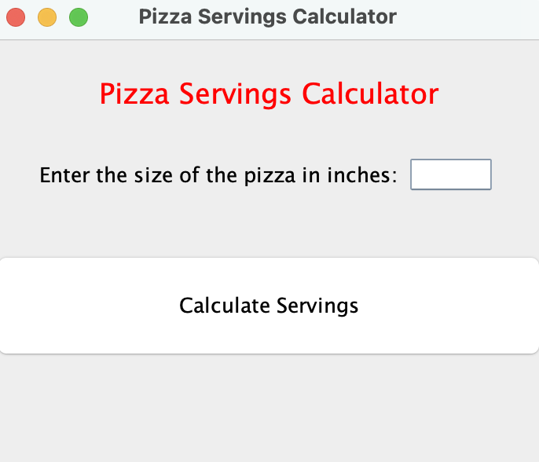

### PizzaServingsCalculatorGUI

#### Table of Contents
1. [Execution at the command line](#execution-at-the-command-line)
2. [`PizzaServingsCalculator` Class](#pizzaservingscalculator-class)
3. [Requirements](#requirements)

#### Execution at the command line

```
javac PizzaServingsCalculator.java &&
java  PizzaServingsCalculator
```


#### `PizzaServingsCalculator` Class

```java
import java.awt.Color;
import java.awt.event.ActionEvent;
import java.awt.event.ActionListener;
import java.awt.Font;
import java.awt.GridLayout;
import javax.swing.JButton;
import javax.swing.JFrame;
import javax.swing.JLabel;
import javax.swing.JPanel;
import javax.swing.JTextField;
import javax.swing.SwingConstants;

public class PizzaServingsCalculator extends JFrame {
  private final JButton    button;
  private final JLabel     label1;
  private final JLabel     label2;
  private final JLabel     label3;
  private final JPanel     panel;
  private final JTextField textField;

  public PizzaServingsCalculator () {
    super("Pizza Servings Calculator");
    setLayout(new GridLayout(4, 1, 0, 0));

    label1 = new JLabel("Pizza Servings Calculator",              SwingConstants.CENTER);
    label1.setForeground(Color.RED);
    label1.setFont(new Font(label1.getFont().getName(), Font.PLAIN, 18));
    label2 = new JLabel("Enter the size of the pizza in inches:", SwingConstants.CENTER);
    label3 = new JLabel("",                                       SwingConstants.CENTER);

    textField = new JTextField("", 4);
    textField.setEditable(true);

    ButtonHandler handler = new ButtonHandler();
    button = new JButton("Calculate Servings");
    button.addActionListener(handler);

    panel = new JPanel();
    panel.add(label2);
    panel.add(textField);

    add(label1);
    add(panel);
    add(button);
    add(label3);
  }

  private class ButtonHandler implements ActionListener {
    @Override
    public void actionPerformed (ActionEvent e) {
      double size     = Double.parseDouble(textField.getText());
      double servings = Math.pow((size / 8), 2);
      label3.setText(String.format("A %.0f inch pizza will serve %.2f people.", size, servings));
    }
  }

  public static void main (String[] args) {
    PizzaServingsCalculator pizzaServingsCalculator = new PizzaServingsCalculator();
                            pizzaServingsCalculator.setDefaultCloseOperation(JFrame.EXIT_ON_CLOSE);
                            pizzaServingsCalculator.setSize(350, 300);
                            pizzaServingsCalculator.setVisible(true);
  }
}
```

#### Requirements

Write a GUI to calculate the number of servings that a circular pizza of a certain diameter will make. The GUI will have the following appearance:



It must include the following features:
* the frame title must say 'Pizza Servings Calculator'
* a grid layout will be used for the GUI
* the `JLabel` title of the GUI will say 'Pizza Servings Calculator' and be in red and will be placed in grid slot 1
* a `JLabel` of 'Enter the size of the pizza in inches: ' will be placed in grid slot 2 followed by a `JTextField` where the pizza size will be entered and have a width of 4
* A `JButton` will be placed in grid slot 3 and will contain 'Calculate Servings'
* a `JLabel`, initially blank, will be placed in grid slot 4

To execute the GUI, enter a pizza size in the `JTextField` and click the Calculate Servings button. The Calculate Servings button handler will then execute and calculate the number of servings and display it as shown in the following image:


The number of servings will be calculate using the following formula: `servings = (size / 8)**2` and displayed to two decimal places. You can use the `Double.parseDouble(textField.getText());` to get the string value from the `JTextField` and parse it to a double. This formula assumes that an 8 inch pie makes 1 serving. Based on the area of an 8" pie as one serving, the number of servings will vary with the ratio of the radius of the new pie to the 8" pie squared. Therefore, a 16" pie would give you a ratio of 16/8 or 2 squared which is 4 servings. Line 2 of the GUI contains two GUI components but each cell of a grid can only contain one component. This is where `JPanels` come in for GUI design. A `JPanel` is a container that simply holds other components, so we can use a `JPanel` as the component for line 2. We can create a `JPanel` by using a statement like `private JPanel line2 = new JPanel();`. Then we can add components to it with statements like `line2.add(variable that represents your JLabel for Enter the size of the pizza...);`. Then we can add line2 to the grid layout in slot 2. To set the layout of the frame to a 4 line grid layout, you would use a `setLayout` statement such as `setLayout(new GridLayout(4,1));`. Once the servings have been calculated, they are displayed in the `JLabel` in grid slot 4 as shown. Set the size of your GUI to (350, 300). This should give it the appearance as shown above. The class that represents the GUI should extend `JFrame`. Do not use the NetBeans GUI generator for this project.